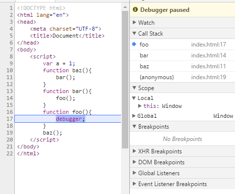

# 第二部分 this和对象原型

## 第一章 关于this

### 1.1 为什么要用this

如果不使用this就需要给函数体显式地传入一个上下文对象，this提供了一种更优雅的方式来隐式传递一个对象的引用，让api设计更简洁而且易于复用。

```
function bar(context){
  return context.name.toUpperCase();
}
bar({name: 'kad'}); // 'KAD'


VS

function bar(){
  return this.name.toUpperCase();
}
bar.call({name: 'kad'}); // 'KAD'
```


### 1.2 误解

#### 1.2.1 指向自身

❌this指向函数自身。看下面例子
```
function foo(num){
  this.count++;
}
foo.count = 0;
for(var i = 0; i < 10; i++){
  if(i > 5) foo(i);
}
console.log(foo.count); // 0 ???
```

很明显foo被调用了4次，但是`foo.count`的值为0，也就说明this并不指向函数自身。

**在函数内部引用自身**： 具名函数在它内部可以使用函数名来引用自身，匿名函数可以使用`arguments.callee`来引用当前正在运行的函数对象。所以可以在foo函数内修改为`foo.count++`，但这样回避了this问题，完全依赖与变量foo的词法作用域。

实际可以强制this指向foo函数对象：

```
function foo(num){
  this.count++;
}
foo.count = 0;
for(var i = 0; i < 10; i++){
  if(i > 5) foo.call(foo, i); // 使用call确保this指向函数对象foo本身
}
console.log(foo.count); //4
```

#### 1.2.2 它的作用域

❌this指向函数的作用域。

this在任何情况下都不指向函数的词法作用域。作用域“对象”无法通过JS代码访问，它存在于JS引擎内部。

```
function foo(){
  var a = 2;
  this.bar();
}
function bar(){
  console.log(this.a);
}
foo(); // undefined， 如果直接console a就会报错ReferenceError，很奇怪难道this.a不是RHS查询？
```

这段代码尝试使用this连通foo和bar的词法作用域，让bar可以访问foo作用域中的变量a，这是不可能实现的。**你不能使用this来引用一个词法作用域内部的东西。**

### 1.3 this到底是什么

this是在运行时进行绑定的，并不是在编写时绑定的，它的上下文取决于函数调用时的各种条件。this的绑定和函数声明的位置没有任何关系，只取决于函数的调用方式。

当一个函数被调用时，会创建一个活动记录（有时也称为执行上下文）。这个记录会包含函数在哪里被调用（调用栈）、函数的调用方法、传入的参数等信息。this就是记录的其中一个属性，会在函数执行的过程中用到。

### 1.4 小结

this既不指向函数自身也不指向函数的词法作用域。

this实际上是在函数被调用时发生的绑定，它指向什么完全取决于函数在哪里被调用。


## 第2章 this全面解析

### 2.1 调用位置

分析好函数在代码中被调用的位置，this到底引用的是什么，也就是分析调用栈（为了到达当前执行位置所调用的的所有函数）。

查看调用栈可以使用浏览器吊事工具，设置断点或者在代码中插入一条debugger语句。运行代码时，调试器会在那个位置暂停，同时展示当前位置的函数调用列表，这就是调用栈。栈中第二个元素就是真正的调用位置。



### 2.2 绑定规则

在函数的执行过程中调用位置决定this的绑定对象。

#### 2.2.1 默认绑定 

直接使用不带任何修饰的函数引用进行调用，this的默认绑定指向全局对象window。

```
function foo(){
  console.log(this.a);
}
var a = 2;
foo(); // 2
```

foo调用时this指向的是全局对象window。严格模式下会输出undefined，全局对象无法使用默认绑定。

#### 2.2.2 隐式绑定

调用位置是否有上下文对象。隐式绑定规则会把函数调用中的this绑定给这个上下文对象。

```
var a = 1;
function foo(){
	console.log(this.a);
}
var obj = {
  a: 2,
  foo: foo
};
obj.foo(); // 2 -----(1)
var f = obj.foo;
f(); // 1 -----(2)
```

(1)处的foo调用位置会使用obj上下文来引用函数。

(2)处的`obj.foo()`引用的是foo函数本身，所以此时f是不带任何修饰的函数调用，应用了默认绑定，this指向window。如果是严格模式则绑定到undefined上。

```
function foo(){
  console.log(this.a);
}
function doFoo(fn){
  fn();
}
var obj = {
  a: 2,
  foo: foo
};
var a = 1;
dooFoo(obj.foo); // 1
```

上面这样传入回调函数和(2)处一样，都会丢失this绑定。还有像setTimeout这样传入回调函数的丢失this绑定是很常见的。

#### 2.2.3 显式绑定

如果不想在对象内部包含函数引用，而想在某个对象上强制调用函数，可以使用函数的**call和apply**方法。JS中所有的函数包括自己创建的函数都可以调用call和apply方法，因为这两个方法都是函数原型上的方法：`Function.prototype.call`。

call和apply的第一个参数是对象，会在函数调用时强制将this绑定给这个对象。

```
function foo(){
  console.log(this.a);
}
var obj = {a: 2};
foo.call(obj); // 2
```

也可以通过一个辅助绑定函数来显示绑定：

```
function foo(b){
  console.log(this.a, b);
  return this.a + b;
}
function bind(fn, obj){
  return function(){
    return fn.apply(obj, arguments);
  }
}
var obj = {a: 2};
var bar = bind(foo, obj);
var c = bar(3); // 2 3
console.log(c); // 5
```

当然在ES5中也提供了内置的方法`Function.prototype.bind`

```
var bar = foo.bind(obj);
var c = bar(3); // 2 3
console.log(c); // 5
```

硬绑定的bar不能再修改它的this了，让我想到箭头函数也是不能修改this 的。

JS一些内置函数也可以确保回调函数使用指定的this。

```
function foo(){
  console.log(this.val);
}
var obj = {val: 'ok'};
[1,2,3].forEach(foo, obj); // ok*3
```

#### 2.2.4 new绑定

在JS中使用new操作符时被调用的函数才是构造函数调用。

使用new发生构造函数调用时，会自动执行下面的操作：

1. 创建一个全新的对象`var fn = new Object();`
2. 设置对象原型链`fn.__proto__ = F.prototype;`
3. 函数调用的this绑定给新对象`F.call(fn);`
4. 如果函数没有返回其他对象，那么new表达式中的函数调用会自动返回这个新对象

```
function foo(a){
  this.a = a;
}
var bar = new foo(2);
console.log(bar.a); // 2
```

使用new调用foo时，会构造一个新对象并把它绑定到foo调用的this上。new是最后一种可以影响函数调用时的this绑定行为的方法。

### 2.3 优先级

* 默认绑定优先级最低。
* 显式绑定比隐式绑定优先级高。
* new绑定比隐式绑定优先级高。
* new和call/apply无法一起使用。
* polyfill代码主要用于旧浏览器的兼容（原意是刮墙的腻子来抹平差异）。

#### [Curry(柯里化)](https://llh911001.gitbooks.io/mostly-adequate-guide-chinese/content/ch4.html#总结)

先看一个curry的简单例子：

```
var add = function(x){
	return function(y){
		return x + y;
	}
}
var increment = add(1);
increment(2); // 3
```

**curry的概念：只传递给函数一部分参数来调用它，让它返回一个函数去处理剩下的参数。这样的局部调用能够大量减少代码。**

文中提到在new中使用硬绑定函数，目的是预先设置函数的一些参数，这样在使用new进行初始化时就可以只传入其余的参数，bind的功能之一就是可以把除了第一个参数（第一个参数用于绑定this）之外的其他参数都传给下层的函数。看例子：

```
function foo(a,b){
  this.val = a+b;
  console.log(this.val);
}
var bar = foo.bind(null, 'a'); // 使用null是因为在本例中并不关心硬绑定的this是什么，反正new时this会被修改
var baz = new bar('b'); // 'ab'
```

#### 判断this

1. 函数是否在new 中调用（new绑定）？如果是的话this绑定的是新创建的对象。`var bar = new foo();`
2. 函数是否通过call、apply（显式绑定）或者硬绑定调用？如果是的话，this绑定的是指定的对象。`var bar = foo.call(obj) ;`
3. 函数是否在某个上下文对象中调用（隐式绑定）？如果是的话，this绑定的是那个上下文对象。`var bar = obj.foo();`
4. 如果都不是，使用默认绑定，绑定到全局对象。如果在严格模式下，就绑定到undefined。`var bar = foo();`

### 2.4 绑定例外

#### 2.4.1 被忽略的this

当把null或undefined作为this的绑定对象传入call、apply或bind时应用的是默认绑定。

```
function foo(){
  console.log(this.a);
}
var a = 2;
foo.call(null); // 2
```

什么情况下会传入null？

1. 使用apply展开一个数组

   ```
   function foo(a, b){
     console.log(a, b);
   }
   foo.apply(null, [1,2]); // 1 2
   ```

   ES6中有提供扩展运算符`...`可以代替apply来展开数组`foo(...[1,2])`

2. 使用bind进行柯里化

  ```
  var bar = foo.bind(null, 1);
  bar(2); // 1 2
  ```

  如果函数并不关心this的话，使用bind仍需要传入一个占位值，就传入null。


#### 更安全的this

使用null来忽略this绑定可能产生一些副作用，比如使用第三方库中的一个函数中的this如果应用了默认绑定规则会把this绑定到全局对象，会导致不可预计的后果（比如修改全局对象）。

一个更安全的做法是传入一个特殊的空对象`Object.create(null)`，和`{}`（等价于 new Object()）不同的是，前者是没有原型链的，比`{}`更空。

#### 2.4.2 间接引用

```
function foo(){
  console.log(this.a);
}
var a = 1;
var o = {a: 2, foo: foo};
var p = {a: 3};
o.foo(); // 2
(p.foo = o.foo)(); // 1
```

赋值表达式`p.foo = o.foo`的返回值是目标函数的引用，此时调用位置是foo，而不是`p.foo`或`o.foo`，会应用默认绑定。

#### 2.4.3 软绑定

因为使用硬绑定之后无法修改this，软绑定就是实现和硬绑定相同的效果同时保留隐式绑定或显式绑定修改this的能力。

注：然而代码没太看懂，也不太想细钻了。

### 2.5 this词法

ES6中的箭头函数不使用this的上面这几种规则， 而是根据外层（函数或全局）作用域来决定this。

```
function foo(){
	setTimeout(function () {
		console.log(this.a);
	}, 0);
}
var a = 1;
var obj = {a: 2};
foo(); // 1
foo.call(obj); // 1
```

箭头函数最常用于回调函数中：

```
function foo(){
	setTimeout(() => {
		console.log(this.a);
	}, 0);
}
var a = 1;
var obj = {a: 2};
foo(); // 1
foo.call(obj); // 2
```

箭头函数会继承外层函数调用的this绑定， 这和ES6之前代码中的`self = this`机制一样。

